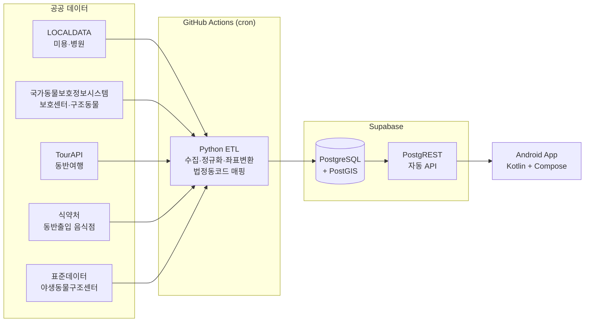

# spec.md — 반려동물 동반 외출·여행 준비 앱 기술 명세

> 문서 역할: **무엇을 정확히 만드는가** (기술 스택 · 아키텍처 · 데이터 · 화면 · 디자인)
> 전략·배경은 `개발계획서.md`, 실행 순서·일정은 `plan.md` 참조
> 버전 0.1 · 2026-08-29 · 근거 및 의사결정 이력은 `DECISIONS.md`

---

## 0. 제품 한 줄 정의

> **반려동물과 낯선 지역에 갈 때, 그 지역의 동물병원·미용·동반 식당·관광지를
> 동(洞) 단위로 한 화면에서 미리 확인하는 앱.**

핵심 차별점은 "통합"이 아니라 **"목적지 기반"** 이다.
기존 앱은 대부분 *현재 위치*("내 주변") 기반이며, 이는 이미 그곳에 있는 사용자를 전제한다.
이 앱은 **아직 가지 않은 지역을 미리 조회**하는 것을 기본 동작으로 삼는다.

---

## 1. 기술 스택 (확정안)

선택 기준은 "최신·최적"이 아니라 **"막혔을 때 검색과 공식 문서로 스스로 풀 수 있는가"** 이다.
(개발자가 앱 개발 첫 프로젝트이므로 — `DECISIONS.md` D-21)

### 1.1 앱 (프론트엔드)

| 항목 | 선택 | 이유 |
|---|---|---|
| 언어 | **Kotlin** 2.x | 안드로이드 공식 언어. 자료·AI 지원 최다 |
| UI | **Jetpack Compose** + Material 3 | 선언형. XML 레이아웃 학습 불필요 |
| 최소 SDK | **API 26** (Android 8.0) | 실사용 기기 대부분 커버. 그 아래는 대응 비용 대비 실익 없음 |
| 타겟 SDK | 출시 시점 Play 정책이 요구하는 최신 | ⚠️ 출시 직전 Play Console에서 반드시 재확인 |
| 아키텍처 | **MVVM + Repository** | 안드로이드 공식 가이드 구조. 예제가 가장 많음 |
| 화면 이동 | Navigation Compose | |
| 네트워크 | **Supabase Kotlin SDK** | 직접 REST 조립 불필요 |
| 이미지 | Coil | Compose 네이티브 지원 |
| 로컬 저장 | Room (즐겨찾기·캐시) + DataStore (설정) | |
| DI | **사용하지 않음** (수동 Container) | ⚠️ Hilt는 초기 학습 부담이 큼. 화면 10개 넘어가면 재검토 |
| 지도 | **Kakao Map Android SDK v2** | 국내 주소·POI 정합성. 앱이 1개이므로 무료 쿼터 유지 |

> **의도적으로 배제한 것**: Hilt(초기), Flutter/RN(안드로이드 단일 타겟에 추상화 계층 불필요),
> 자체 백엔드 서버(운영 부담), GraphQL, 멀티모듈.
> — 첫 프로젝트에서 배워야 할 것을 **Kotlin/Compose와 Python 스크립트 둘로 한정**하기 위함.

### 1.2 백엔드

**직접 서버를 만들지 않는다.**

| 항목 | 선택 | 비고 |
|---|---|---|
| BaaS | **Supabase** | PostgreSQL + PostgREST 자동 API. 무료 티어 |
| DB | PostgreSQL 15+ | |
| 확장 | **PostGIS** | 좌표 반경 검색 (ST_DWithin) |
| 인증 | Supabase Auth (**2차**) | MVP는 로그인 없음. 즐겨찾기는 로컬 저장 |
| 보안 | **RLS 필수** | 공개 데이터는 anon 읽기 전용 정책. 쓰기는 service_role만 |

> ⚠️ **anon key는 앱에 포함되어 노출된다.** 반드시 RLS로 읽기 전용을 강제할 것.
> service_role key는 절대 앱에 넣지 않는다 (ETL의 GitHub Secrets 전용).

### 1.3 데이터 파이프라인 (ETL)

| 항목 | 선택 |
|---|---|
| 언어 | Python 3.12 (httpx, pandas) |
| 좌표 변환 | pyproj (EPSG:5174 등 → EPSG:4326) |
| 실행 | **GitHub Actions schedule cron** (서버 불필요·무료) |
| 적재 | Supabase REST upsert (on_conflict 기준: source + source_id) |
| 비밀값 | GitHub Secrets (SUPABASE_SERVICE_KEY, DATA_GO_KR_KEY 등) |
| 로깅 | sync_logs 테이블 + Actions 실패 시 알림 |

### 1.4 아키텍처 개요



**핵심 원칙: 앱은 공공 API를 직접 호출하지 않는다.**
이유는 세 가지 —

1. 어떤 공공 API도 **동 단위 필터를 지원하지 않음** (시군구가 한계)
2. API마다 **지역코드 체계가 전부 다름** (정규화가 서버에서 선행되어야 함)
3. 공공 API 장애·스펙 변경이 앱에 직접 전파되는 것을 차단

---

## 2. 데이터 소스 계약

### 2.1 소스 목록 및 갱신 정책

| 카테고리 | 소스 | 원본 갱신 | ETL 주기 |
|---|---|---|---|
| `hospital` 동물병원 | LOCALDATA 동물병원 | 월~토 매일 19시 (D-2) | 매일 1회 |
| `grooming` 미용시설 | LOCALDATA 동물미용업 | 동일 | 매일 1회 |
| `restaurant` 동반 식당 | 식약처 반려동물 동반출입 음식점 | 실시간 DB | **주 1회** (API 없음, Excel 파싱) |
| `restaurant` 보조 | 한국문화정보원 문화시설 (15111389) | ⚠️ **갱신 중단** (최종 2025-08-14) | 월 1회 |
| `tour` 관광정보 | TourAPI 반려동물 동반여행 | 최종수정 2026-02-10 | 주 1회 |
| `wildlife_center` 구조센터 | 전국야생동물구조센터 표준데이터 | **연 1회** | 월 1회 |
| 보호센터 | 동물보호센터 정보 shelterInfo_v2 | — | 주 1회 |
| 입양 동물 | 국가동물보호정보시스템 구조동물 조회 | 일 단위 | **매일 1회** |

### 2.2 소스별 처리 주의사항

- **LOCALDATA**: 폐업·휴업 업소가 그대로 포함됨 → 상세영업상태코드 필터 **필수**.
  누락 시 폐업한 병원이 지도에 표시됨.
- **인허가 데이터 좌표**: WGS84가 아니라 **EPSG:5174**(보정계수 없는 Bessel 중부원점TM) → 4326 변환 필요.
  행안부 동물병원 조회서비스(15154952) 문서가 이 좌표계를 명시하고 있다(2026-09-02 확인).
  ⚠️ 그래도 **1단계 착수 시 실제 응답 좌표를 지도에 찍어 한 번 더 검증할 것.**
  EPSG:5174 는 5179(UTM-K)·5186 등과 혼동하기 쉽고, 틀리면 수백 m 씩 어긋난다.
- **식약처**: 오픈API 없음. Excel 다운로드 → 파싱. 구조 변경 시 ETL 파손 가능 → 실패 알림 필수.
- **식약처 목록의 불완전성**: 사이트 명시 — *"현황에 포함되지 않은 영업자도 시설기준을 지켰다면 동반 출입 가능"*.
  → **UI에서 "동반 불가"로 단정 표기 금지.** "등록 업소" 라는 표현만 사용.
- **좌표 결측**: 주소만 있고 좌표가 없는 레코드 존재 → 카카오 로컬 API 지오코딩으로 보완.
- **트래픽 한도**: 데이터셋마다 다르다. 실측(2026-09-02) 기준 구조동물 조회(15098931)와
  행안부 동물병원 조회서비스(15154952)는 **개발계정 10,000건/일**, 동물보호센터(15035887)는 1,000건/일.
  운영계정은 활용사례 등록 시 증량 신청 가능. ETL은 **증분(변경분)만** 수집하도록 설계.
- **LOCALDATA API 는 변경분만 준다.** 전체 데이터는 API 가 아니라 다운로드 페이지에서 받는다
  (전체분 매월 2일 배포). → **최초 1회 전체분 → 이후 API 증분** 2단 구조로 짠다.
- **인증키**: 공공데이터포털은 계정당 1개(`DATA_GO_KR_KEY`)이고 데이터셋별로 활용신청을 건다.
  LOCALDATA 는 **별도 사이트·별도 키**다. 반드시 **Decoding 키**를 쓴다(§ETL 주의).

---

## 3. 데이터 모델

### 3.1 regions — 지역코드 정규화 테이블 ★ 이 앱의 핵심 자산

API마다 지역코드 체계가 다르므로, **법정동코드를 기준으로 전부 흡수**한다.
한 번 만들면 이후 어떤 공공 API를 추가해도 재사용된다.

```sql
CREATE TABLE regions (
  code            TEXT PRIMARY KEY,      -- 법정동코드 10자리
  level           SMALLINT NOT NULL,     -- 1=시도 2=시군구 3=읍면동
  parent_code     TEXT REFERENCES regions(code),
  sido_name       TEXT NOT NULL,
  sigungu_name    TEXT,
  dong_name       TEXT,
  full_name       TEXT NOT NULL,         -- 예: 경기도 성남시 분당구 정자동
  center_lat      DOUBLE PRECISION,
  center_lng      DOUBLE PRECISION,
  -- 외부 코드 매핑
  apms_upr_cd     TEXT,                  -- 국가동물보호정보시스템 시도
  apms_org_cd     TEXT,                  --            〃        시군구
  localdata_cd    TEXT,                  -- LOCALDATA 지역코드
  tour_area_cd    TEXT,                  -- TourAPI areaCode
  tour_sigungu_cd TEXT                   -- TourAPI sigunguCode
);
CREATE INDEX ON regions(parent_code);
CREATE INDEX ON regions(level);
```

> 기준 데이터는 **행정표준코드관리시스템(code.go.kr)의 법정동코드 전체자료** 를 출발점으로 사용한다.
> (당초 TourAPI 법정동코드정보를 쓰려 했으나, TourAPI 는 지역코드가 옛 행정구역 체계라
>  기준으로 삼을 수 없다 — DECISIONS D-29·D-30·D-31)

**외부 코드 매핑은 1:1 이 아니다.**

| 관계 | 예 |
|---|---|
| N:1 | `성남시 분당구`·`수정구`·`중원구` → APMS/TourAPI 모두 `성남시` 하나 (일반구가 없다) |
| 1:N | `전남광주통합특별시` → TourAPI `5`(광주) + `38`(전남) |
| NULL | 세종특별자치시의 `apms_org_cd` — 세종은 시군구가 없다 |

읍면동(level 3)에는 **부모 시군구의 코드를 그대로 내려 쓴다.** 두 API 모두 읍면동 코드를
제공하지 않고, 앱은 읍면동을 고른 뒤 시군구 단위로 외부 API 를 부르기 때문이다.

⚠️ **TourAPI POI 를 `region_code` 에 배정할 때는 코드가 아니라 `addr1` 문자열을 파싱한다.**
TourAPI 는 코드만 옛 체계이고 주소는 새 체계라, 코드로는 제물포구/영종구를 구분할 수 없다 (D-31).

### 3.2 places — POI 통합 테이블 ★ 재사용 전략의 DB 구현

메뉴 1·2·3·4·7을 **하나의 테이블**로 통합한다.
카테고리가 달라도 구조가 같으므로, **지도·목록·상세 화면 코드를 1벌만 만들면 된다.**

```sql
CREATE TYPE place_category AS ENUM
  ('hospital','grooming','restaurant','tour','wildlife_center');

CREATE TABLE places (
  id                BIGSERIAL PRIMARY KEY,
  category          place_category NOT NULL,
  source            TEXT NOT NULL,       -- localdata | mfds | tourapi | stddata | kcisa
  source_id         TEXT NOT NULL,       -- 원본 고유키 (upsert 기준)
  name              TEXT NOT NULL,
  tel               TEXT,
  address_road      TEXT,
  address_jibun     TEXT,
  lat               DOUBLE PRECISION,
  lng               DOUBLE PRECISION,
  geom              GEOGRAPHY(POINT,4326),
  region_code       TEXT REFERENCES regions(code),
  status            TEXT DEFAULT 'open', -- open | closed | suspended
  extra             JSONB DEFAULT '{}',  -- 카테고리별 추가 필드
  source_updated_at TIMESTAMPTZ,         -- 원본 기준일 (UI 노출용)
  synced_at         TIMESTAMPTZ DEFAULT now(),
  UNIQUE (source, source_id)
);
CREATE INDEX ON places USING GIST (geom);
CREATE INDEX ON places (region_code, category) WHERE status = 'open';
```

extra JSONB 사용 예:

- `hospital` — `{"open_24h": true, "business_hours": "..."}`
- `restaurant` — `{"registered_mfds": true, "pet_area": "실내"}`
- `tour` — `{"content_id": "...", "image_url": "...", "pet_policy": "..."}`

### 3.3 shelters / animals — 입양 탭

```sql
CREATE TABLE shelters (
  care_reg_no   TEXT PRIMARY KEY,        -- 보호센터 등록번호
  name          TEXT NOT NULL,
  tel           TEXT,
  address       TEXT,
  lat           DOUBLE PRECISION,
  lng           DOUBLE PRECISION,
  region_code   TEXT REFERENCES regions(code),
  save_target   TEXT,                    -- 구조 대상 동물
  org_name      TEXT,                    -- 관할 기관
  extra         JSONB DEFAULT '{}',
  synced_at     TIMESTAMPTZ DEFAULT now()
);

CREATE TABLE animals (
  desertion_no  TEXT PRIMARY KEY,        -- 유기번호
  care_reg_no   TEXT REFERENCES shelters(care_reg_no),
  region_code   TEXT REFERENCES regions(code),
  kind_name     TEXT,                    -- 품종
  color         TEXT,
  age           TEXT,
  weight        TEXT,
  sex           TEXT,                    -- M | F | Q
  neuter        TEXT,                    -- Y | N | U
  happen_dt     DATE,
  happen_place  TEXT,
  notice_sdt    DATE,
  notice_edt    DATE,
  process_state TEXT,                    -- 공고중 / 종료(입양) 등
  image_url     TEXT,
  special_mark  TEXT,
  synced_at     TIMESTAMPTZ DEFAULT now()
);
CREATE INDEX ON animals (region_code, process_state, notice_edt DESC);
```

> ⚠️ **범위 제한 명시**: 이 데이터는 **지자체 지정 동물보호센터** 기준이다.
> 케어·카라 등 **민간 단체의 자체 구조·분양 동물은 포함되지 않는다.**
> → UI에서 "동물구조단체"가 아니라 **"동물보호센터"** 라고 표기할 것.

### 3.4 sync_logs — 운영 관측

```sql
CREATE TABLE sync_logs (
  id            BIGSERIAL PRIMARY KEY,
  source        TEXT NOT NULL,
  started_at    TIMESTAMPTZ,
  finished_at   TIMESTAMPTZ,
  rows_upserted INT,
  status        TEXT,                    -- success | partial | failed
  error         TEXT
);
```

---

## 4. API 계약 (앱 ↔ Supabase)

PostgREST 자동 생성 엔드포인트 + 필요한 것만 RPC로 추가한다.

| 용도 | 호출 |
|---|---|
| 지역 콤보 (계층) | `GET /regions?parent_code=eq.{code}&order=full_name` |
| 지역 검색 | `GET /regions?full_name=ilike.*{q}*&level=eq.3&limit=20` |
| 지역 내 장소 | `GET /places?region_code=eq.{code}&category=in.({cats})&status=eq.open` |
| 반경 검색 (RPC) | `POST /rpc/places_nearby` — `{lat, lng, radius_m, categories}` |
| 장소 상세 | `GET /places?id=eq.{id}` |
| 입양 목록 | `GET /animals?region_code=eq.{code}&process_state=like.*공고중*&order=notice_sdt.desc` |
| 보호센터 | `GET /shelters?region_code=eq.{code}` |
| 데이터 기준일 | `GET /sync_logs?status=eq.success&order=finished_at.desc&limit=1` |

반경 검색 RPC 정의:

```sql
CREATE FUNCTION places_nearby(
  p_lat DOUBLE PRECISION,
  p_lng DOUBLE PRECISION,
  p_radius_m INT,
  p_categories place_category[]
) RETURNS SETOF places
LANGUAGE sql STABLE AS
'SELECT * FROM places
   WHERE status = ''open''
     AND category = ANY(p_categories)
     AND ST_DWithin(geom, ST_MakePoint(p_lng, p_lat)::geography, p_radius_m)
   ORDER BY geom <-> ST_MakePoint(p_lng, p_lat)::geography
   LIMIT 200';
```

> **지역 콤보가 3단(시도→시군구→읍면동)인 이유**: 원래 구상의 "동 단위 검색" 요구를 그대로 구현한 것이며,
> 목적지 기반 조회라는 제품 정체성의 UI 표현이다.

---

## 5. 화면 명세

### 5.1 정보 구조

```
[하단 탭]  ← 4개 (D-39)
 ├── 홈  ← 허브. 앱을 켜면 여기
 │    ├── 상단 지역 칩 "서울특별시 마포구 연남동 ˅"  → 탭하면 S-01
 │    ├── 카테고리 6칸 그리드 (동물병원·미용·식당·관광·구조센터·입양)
 │    └── 선택 지역 요약 — 카테고리별 건수
 ├── 지도 탐색  ← MVP 범위
 │    ├── 지도 + 카테고리 필터 + 목록 바텀시트
 │    └── 장소 상세
 ├── 구조·입양  ← 6단계
 │    ├── 입양 동물 목록 (그리드)
 │    ├── 동물 상세
 │    └── 보호센터 상세
 └── 더보기
      ├── 즐겨찾기
      ├── 데이터 출처 및 기준일
      ├── 개인정보처리방침
      └── 앱 정보
```

> S-01 지역 선택은 **탭이 아니라 홈의 지역 칩에서 여는 화면**이다. 앱의 기준점이
> "현재 위치"가 아니라 **"내가 고른 지역"** 이라는 것을 칩이 항상 보여준다 (D-24·D-39).

### 5.2 화면별 요구사항

**S-00 홈** (D-39)

- 상단에 **선택된 지역 칩** — 반드시 **읍면동까지** 표기. 탭하면 S-01 을 연다.
- **카테고리 6칸 그리드** — 탭하면 그 카테고리로 필터된 S-02 로 간다.
- 선택 지역의 카테고리별 건수를 함께 보여준다 ("동물병원 12").
- ⚠️ **"내 주변 N km" 를 홈의 주인공으로 두지 않는다.** 위치 기반 탐색은 S-02 안에 둔다.
  이 앱은 *가기 전에 미리 보는* 도구다 — 현재 위치가 기준이면 기존 지도앱과 구분되지 않는다 (D-24).
- 큐레이션 섹션("이번 주 가기 좋은 곳")은 **넣지 않는다.** 매주 사람이 고르는 운영 비용이 든다.

**S-01 지역 선택** — S-00 의 지역 칩에서 여는 화면

- 시도 → 시군구 → 읍면동 3단 드롭다운. 각 단계는 상위 선택 시에만 활성화.
- 지역명 직접 검색 입력 지원 (full_name ilike).
- "현재 위치로" 버튼 — 권한 거부 시에도 지역 선택으로 정상 사용 가능해야 함.
- **최근 선택 지역 3개**를 상단에 노출 (여행 준비 중 반복 조회 대응).

**S-02 장소 지도**

- 지도 + 하단 **바텀시트 3단**(peek 20% / half 50% / full 90%) — 국내 지도앱 관용 패턴.
- 상단 **카테고리 필터 칩**(복수 선택): 동물병원 / 미용 / 식당 / 관광 / 야생동물구조센터.
- 지도 핀은 **카테고리별 색상·아이콘**으로 구분.
- 핀 50개 초과 시 클러스터링.
- 선택 지역 경계 밖으로 지도를 이동하면 **"이 지역에서 다시 검색"** 버튼 노출.

**S-03 장소 상세**

- 이름 / 카테고리 / 도로명·지번 주소 / 전화(탭하면 발신) / 영업상태
- 카테고리별 추가 정보 (extra)
- 액션: 길찾기(카카오맵 연동) · 전화 · 공유 · 즐겨찾기
- **하단에 출처와 기준일 필수 표기** — 예: `출처: LOCALDATA · 기준일 2026-08-28`
- ⚠️ **별점·후기·장소 사진은 넣지 않는다** (D-40). 공공데이터에 없는 필드다.
  시안이 별점을 놓았던 자리에는 **`출처 · 기준일`** 을 놓는다 — 여행 준비 도구에서는
  "이 정보가 언제 것인가"가 별점보다 신뢰에 직접 기여한다.
- 식당 카테고리에는 고정 안내문:
  > "식약처에 등록된 동반출입 업소입니다. 목록에 없어도 동반 가능한 곳이 있을 수 있으니 방문 전 확인하세요."

**S-04 입양 목록 / S-05 동물 상세 / S-06 보호센터 상세** — 6단계에서 상세 설계

**S-07 즐겨찾기** — 로컬(Room) 저장. 로그인 불필요.

**S-08 데이터 출처** — 소스별 기준일과 원본 링크 전체 목록.
신뢰성 확보 및 공공데이터 이용 표기 의무 대응.

### 5.3 상태 처리 원칙

| 상태 | 표시 |
|---|---|
| 로딩 | 스켈레톤 (스피너 지양) |
| **데이터 없음** | "이 지역에는 등록된 ○○이 없습니다" |
| **불러오기 실패** | "정보를 불러오지 못했습니다" + 재시도 버튼 |
| 오프라인 | 마지막 조회 결과를 캐시에서 표시 + 상단에 "오프라인" 배너 |

> ⚠️ **"데이터 없음"과 "불러오기 실패"를 절대 같은 화면으로 처리하지 않는다.**
> 사용자가 "이 동네엔 병원이 없구나"로 오해하면 앱 신뢰가 무너진다.

---

## 6. 디자인 컨셉

### 6.1 컨셉 — "차분한 안내자"

이 앱은 **여행 준비 도구**이지 엔터테인먼트가 아니다.
반려동물 앱이 흔히 쓰는 과한 파스텔·캐릭터·둥근 말풍선 톤을 **의도적으로 피한다.**
낯선 지역에서 병원을 찾는 순간에 필요한 것은 귀여움이 아니라 **정확함과 침착함**이다.

| 원칙 | 의미 |
|---|---|
| 정보 우선 | 장식보다 주소·전화·영업상태가 먼저 읽혀야 함 |
| 출처 투명 | 모든 정보에 출처와 기준일. 공공데이터 기반 앱의 유일한 신뢰 근거 |
| 침착한 색 | 채도를 낮게. 강한 색은 **행동(CTA)과 응급에만** 사용 |
| 한 손 조작 | 주요 액션은 화면 하단 1/3 안에 배치 |

### 6.2 컬러

Material 3 기반. **브랜드 팔레트를 기본으로 고정하고, Dynamic Color 는 끈다** (D-44).

> 처음에는 "Dynamic Color 를 지원하되 브랜드 팔레트를 fallback 으로" 였다. 그런데 그렇게 하면
> Android 12+ 에서는 **항상** 배경화면 색이 이기므로 브랜드 색이 사실상 쓰이지 않는다.
> 게다가 지도 핀 색은 하드코딩이라, 주변 UI 만 배경화면을 따라가면 핀과 충돌한다.

| 역할 | 값 | 용도 |
|---|---|---|
| Primary | `#2E6B4F` 딥 그린 | 브랜드, 선택 상태, 주요 버튼 |
| Primary Container | `#B8E0C8` | 선택된 필터 칩 |
| Secondary | `#E8734A` 웜 오렌지 | 강조, 즐겨찾기 |
| **Error / Emergency** | `#D64545` | ⚠️ **응급·오류 전용. 다른 용도로 절대 사용 금지** |
| Background | `#FAF7F0` (라이트) / `#14181A` (다크) | 앱 바탕 — **웜 크림** |
| Surface (카드) | `#FFFFFF` (라이트) / `#1E2224` (다크) | 배경 위에 떠 보이는 면 |
| Primary Soft | `#E8F3EC` (라이트) / `#1F5136` (다크) | 아이콘 원형 배경 · 선택된 칩 |
| On-Surface Variant | 웜 그레이 | 보조 텍스트, 기준일 표기 |

**카테고리 색상** (지도 핀·필터 칩 공용, 색만으로 구분하지 말고 **아이콘을 함께** 사용):

| 카테고리 | 색 | 아이콘 |
|---|---|---|
| 동물병원 | `#2E6B4F` | 십자 + 발자국 |
| 미용 | `#7B5EA7` | 가위 |
| 식당 | `#E8734A` | 포크·나이프 |
| 관광 | `#3A7CA5` | 산·깃발 |
| 야생동물구조센터 | `#6B7A3F` | 나뭇잎 |

> **다크 모드 필수.** 위 값은 라이트 기준이며 다크는 Material 3 토큰 규칙에 따라 별도 정의.

**지도 핀은 딥그린·오렌지 2색으로 줄인다** (D-39). 5색을 지도 위에 흩으면 산만해지고,
색약 사용자에게 보라(`#7B5EA7`)와 파랑(`#3A7CA5`)은 구분이 어렵다.
`§6.5` 가 이미 "색만으로 구분하지 않는다"를 요구하므로 **아이콘이 서로 다르면 2색으로 충분하다.**
위 5색은 **필터 칩·카테고리 배지**처럼 라벨이 함께 붙는 자리에서만 계속 쓴다.

### 6.3 타이포그래피

- 서체: **Pretendard** (오픈소스, 한글 가독성 우수) — 앱에 번들.
- 스케일: Material 3 Type Scale 준수.
- 장소명 titleMedium / 주소 bodyMedium / **기준일·출처 labelSmall + On-Surface Variant**.
- 숫자·전화번호는 tabular figures 적용.

### 6.4 컴포넌트

**형태 (D-47)** — 시안은 M3 기본값보다 눈에 띄게 둥글다. 이 곡률이 톤의 절반을 만든다.
`ui/theme/Shape.kt` 한 곳에서만 고친다.

| 역할 | 값 |
|---|---|
| 카드 | 20dp |
| 드롭다운 필드 | 14dp |
| 검색창 · 주요 버튼 · 칩 | **알약**(50%) |
| 화면 좌우 여백 / 섹션 간격 / 카드 안쪽 여백 | 20dp / 24dp / 20dp |

| 컴포넌트 | 규격 |
|---|---|
| 지역 선택 드롭다운 | 3단 계층, 미선택 시 하위 비활성 |
| 카테고리 필터 칩 | Material 3 FilterChip, 복수 선택, 가로 스크롤 |
| 장소 카드 | 이름 · 카테고리 배지 · 주소 1줄 · 거리 · 영업상태 |
| 바텀시트 | 3단 스냅 (peek / half / full) |
| 출처 배지 | 상세 화면 하단 고정. `출처 · 기준일` |
| 빈 상태 | 일러스트 없이 텍스트 + 액션 버튼 |
| 지역 칩 (홈 상단) | 읍면동까지 표기 · 탭하면 S-01 · 아이콘 + 펼침 화살표 |
| 카테고리 그리드 (홈) | 2열 카드 · 아이콘 + 라벨 + 건수 |

### 6.5 접근성

- 최소 터치 타겟 **48dp**
- 본문 명도 대비 **4.5:1** 이상
- 모든 아이콘 버튼에 contentDescription
- 시스템 글꼴 크기 확대(최대 200%)에서 레이아웃이 깨지지 않을 것
- **색상만으로 정보를 구분하지 않는다** (카테고리는 색 + 아이콘 + 라벨)

---

## 7. 비기능 요구사항

| 항목 | 기준 |
|---|---|
| 지도 첫 렌더 | 3초 이내 (LTE 기준) |
| 지역 내 목록 조회 | 1.5초 이내 |
| APK 크기 | 30MB 이하 |
| 오프라인 | 마지막 조회 결과 캐시 표시 |
| 데이터 신선도 | 모든 화면에서 기준일 확인 가능 |
| 크래시율 | 1% 미만 (Play Console 기준) |
| 지도 API 호출 | 서버 캐싱으로 최소화 (쿼터 초과 시 과금) |

---

## 8. 보안 · 법적 요건

- **anon key 노출 전제** → RLS로 읽기 전용 강제. service_role key는 앱에 절대 미포함.
- **위치 권한**: ACCESS_COARSE_LOCATION만 요청. 거부해도 지역 선택으로 전 기능 사용 가능.
- **수집 개인정보 없음** (MVP 기준) → 개인정보처리방침에 명시.
- **공공데이터 이용 표기**: 각 소스의 이용 조건에 따른 출처 표시 (S-08 화면).
- Play Console 필수 항목: 개인정보처리방침 URL · 데이터 안전 섹션 · 앱 콘텐츠 등급.

---

## 9. MVP 범위 정의

**MVP = [장소] 탭 + 동물병원 · 미용 · 야생동물구조센터**

포함: S-00 홈 / S-01 지역 선택 / S-02 지도 / S-03 상세 / S-07 즐겨찾기 / S-08 출처
제외: 구조·입양 탭, 식당, 관광, 로그인, 여행 묶음, 응급 모드, **별점·후기·장소 사진**

> **이유**: Play 개인 개발자 계정은 프로덕션 전 **테스터 12명 × 14일** 요건이 있다.
> 전체를 완성한 뒤 테스트를 시작하면 최소 2주가 순수 대기로 소모된다.
> **MVP로 먼저 비공개 테스트 트랙에 올리고, 남은 기능을 개발하면서 테스트 기간을 소진한다.**

---

## 10. 후순위 (지금 만들지 않음)

- 여행 묶음 — 지역 하나의 병원·식당·관광지를 한 세트로 저장
- 응급 모드 — 낯선 지역에서 24시간 동물병원 최단 거리
- **별점·후기** (D-40) — 사용자가 충분히 모인 뒤. 로그인·신고·차단·운영이 세트로 따라온다
- **장소 사진** — 관광지(TourAPI `image_url`) 외에는 조달처가 없다
- **여행 코스 추천** ("2시간 코스") — 코스 엔티티와 큐레이션 운영이 필요하다
- 사용자 리뷰·제보 (데이터 보정)
- 로그인·기기 간 즐겨찾기 동기화
- 민간 동물보호단체 데이터 (제휴 필요)
- iOS
